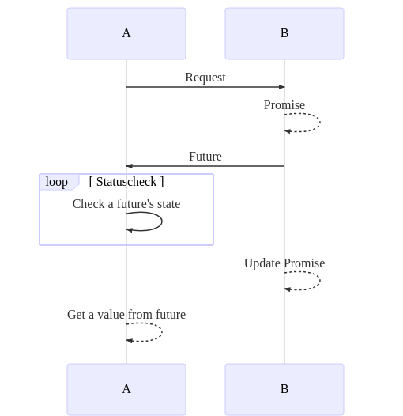
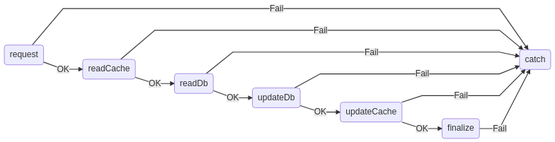
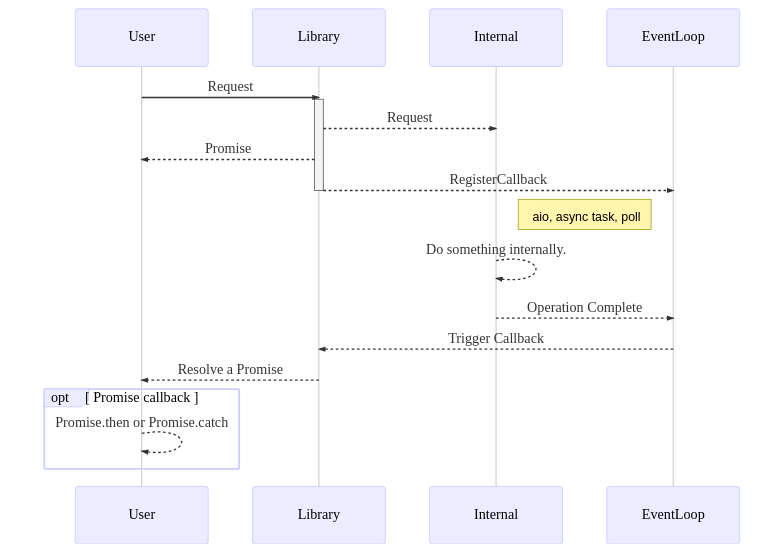
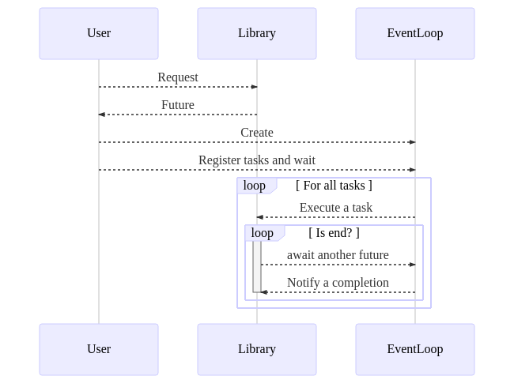

@title[Introduction]
### Asynchronous programming on @color[blue](Javascript) and @color[red](Python).

---
@title[Futures and promises]

#### Futures and promises

> Futures and promises originated in functional programming and related paradigms (eg. logic) to decouple @color[blue](a value (a future)) from how it was @color[red](computed (a promise)).

@size[0.5em](https://en.wikipedia.org/wiki/Futures_and_promises)

---
@title[Code stub]

#### Simple stub for Future and Promise

```javascript
class Promise<T> {
  getFuture(): Future<T>;
  setValue(T | Error);
};
class Future<T> {
  getValue(): T;
  getState(): FutureState;
}

// Make a promise for async job.
const future: Future<{}> = requestAsync();
// Get a result synchronously.
const result = future.get();
```

---
@title[Sequence diagram]

#### Simple sequence diagram



---
@title[Callback]

When there was **no `Promise`**,  
we should give a `callback` to run something after completion.

```javascript
requestAsync(foo, bar, function () {
  // do something.
});
```

---
@title[Callback hell]

**Welcome to the callback hell.**

```javascript
receiveRequest(handle, function () {
  readFromCache(request.userId, function () {
    readFromDatabase(request.orderId, function () {
      // Make an order.
      updateDatabase(order, function () {
        // Update an user's account.
        updateCache(user, function () {
          finalizeRequest(handle, function () {
            // Release all these resources.
          });
        });
      });
    }); 
  });
});
```

And how can I put an *error handler* or *if-statement*?

---
@title[Continuation passing style]

#### Continuation passing style

How about this style?

```javascript
receiveRequest(handle)
  .then(function (context) { readFromCache(context.userId); })
  .then(function (context) { readFromDatabase(context.orderId); })
  .then(function (context) { updateDatabase(context.order); })
  .then(function (context) { updateCache(context.user); })
  .then(function (context) { finalizeRequest(context.handle); })
  .catch(function (error) { /* handle an error */ });
```

At least depth is not deepened. But how can I do this?

---
@title[Arrow function]

But, wait a moment.

We have the *arrow function*. Yes, it is the javascript story.

```javascript
receiveRequest(handle)
  .then(context => readFromCache(context.userId))
  .then(context => readFromDatabase(context.orderId))
  .then(context => updateDatabase(context.order))
  .then(context => updateCache(context.user))
  .then(context => finalizeRequest(context.handle))
  .catch(error => /* handle an error */);
```

Anyway, then how?

---
@title[Promise]

It is because `Promise`.

```javascript
const promise = new Promise((resolve, reject) => {
  fantasticCallback(foo, (error, result) => {
    if (error) reject(error);
    else resolve(result);
  })
});
promise.then(result => {
    // It will be called after this promise is resolved.
  }).catch(error => {
    // Of course, a promise can be broken by an error.
  });
```

So, you can make a chain of promises like this. ~~Actually, it is similar with `monad`.~~


---
@title[Monad?]


---
@title[The python story]

In fact, This is mostly about IO that request and completion can be separated.

So, python, hmm. ~~twisted..tornado..~~

- [gevent](http://www.gevent.org/)? [asyncio](https://docs.python.org/3/library/asyncio.html)?
- Or [Async and await](https://www.python.org/dev/peps/pep-0492/)?

There is no `promise` like js in py-native. ~~asyncio~~

*To be honest, python doesn't have event loop as its core.*

---
@title[Please make me sync style]

BTW, I think a synchronous way is more easy.

Is there a magic way to write it as @color[blue](**synchronous style**)?

```javascript
try {
  const request = magic receiveRequest(handle);
  const user = magic readFromCache(request.userId);
  const order = magic readFromDatabase(context.orderId);
  magic updateDatabase(order);
  magic updateCache(user);
  magic finalizeRequest(handle);
} catch (error) { // handle this error. }
```

---
@title[async/await]

The *magic* is `async` and `await`.

```javascript
(async () => {
  try {
    const request = await receiveRequest(handle);
    const user = await readFromCache(request.userId);
    const order = await readFromDatabase(context.orderId);
    await updateDatabase(order);
    await updateCache(user);
    await finalizeRequest(handle);
  } catch (error) { // handle this error. }
})();
```

@size[0.8em](It is exactly same with *callback* or *promise-chain* logic. A javascript compiler, actually babel or tsc, will transpile this to be running asynchronously.)

@size[0.7em](*You can use `await` keyword only in `async` function or `Promise` constructor.*)

---
@title[Async internal]

It can be converted to a simple state machine.



- Compiler replaces async function as state machine.
- A state will be changed when callback is called.
- If there is an error, `catch` will catch it.

---
@title[Async internal #2]

But if you think about it, would not it be okay to pause a function's execution flow to wait a callback?

So, maybe, can we call this function to *resumable function*? @fa[laugh]

---
@title[Coroutine]

#### Coroutine

> Coroutines are generalize subroutines for non-preemptive multitasking, by allowing multiple entry points for suspending and resuming execution at certain locations. 

@size[0.5em](https://en.wikipedia.org/wiki/Coroutine)

@size[0.8em](But it seems to be difficult. Is there more **easy** one?)

---
@title[Generator]

#### Generator

> A generator yields the values one at a time, which allows the caller to get started processing the first few values immediately. In short, it looks like a function but behaves like an iterator.

@size[0.5em](https://en.wikipedia.org/wiki/Generator_%28computer_programming%29)

@size[0.8em](...`yield`?)

---
@title[An example for generator]

```javascript
function* asyncJob() {
  // Do something1
  yield promise;
  // Do something2
  yield anotherPromise;
  // Do something3
}
const iterator = asyncJob();
const processHandle = iterator => {
  const handle = iterator.next();
  if (handle.done) return;
  handle.then(() => processHandle(iterator));
}
processHandle(iterator);
```

So, we can re-enter *asyncJob* function  
because it is a *generator function*.

---
@title[Generator in python]

Happily, python has `generator` too, but there is no `promise`, so we should solve the `promise` issue to use asynchronous function in python.

**What differences can you make in @color[blue](javascript) and not in @color[red](python)?**

---
@title[Javascript eventloop]

#### EventLoop in javascript (nodejs)



---
@title[Python asyncio]

But, python doesn't have the event loop internally.

```python
async def foo():
  # prepare
  await bar()

loop = asyncio.get_event_loop()
future = foo()  # (1)
handle = asyncio.wait([future])  # (2)
loop.run_until_complete(handle)  # (3)
```

- We should create a loop explicitly.
- *prepare* codes would not be executed until *(3)*.

---
@title[Javascript eventloop]

#### EventLoop in python



---
@title[Javascript vs Python]

- Javascript (nodejs)
  - Based on EventLoop engine.
  - Designed almost libraries to be asynchronous.

- Python
  - Supported async/await lately.
  - Few libraries supports `asyncio`
  - And often have their own future-promise.

---
@title[Performance]

- Is EventLoop fast enough?
- Can a task run fast enough?
- Is it possible to handle a single thread sufficiently?
- Are there any parts that are synchronously running in the middle?

@color[gray](@size[0.7em](This is a story that is different from `distributed`, `parallel`. But `Promise.all` seems to be like `fork-join`.))

---
@title[Concurrency issue]

In spite of being a single thread,  
we must be careful of the ABA problem.

```javascript
if (global.progress) {
  showErrorPopup();
  return;
}
if ((await askToUser()) === false) return;
doStuff(); // Is it really safe?
```

Before and after `await`,  
@color[red](**shared states** will be totally different.)

---
@title[Practice]

I recommend you to design a simple *worker-pool model* with a *task scheduler*.

I think it will help you to understand these internals. @fa[graduation-cap]
